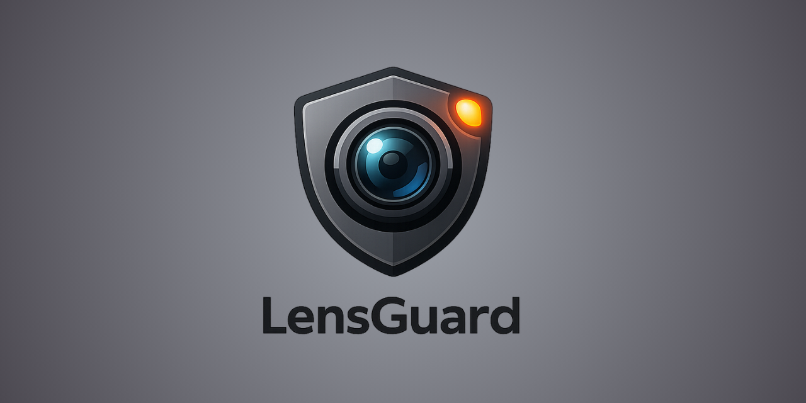
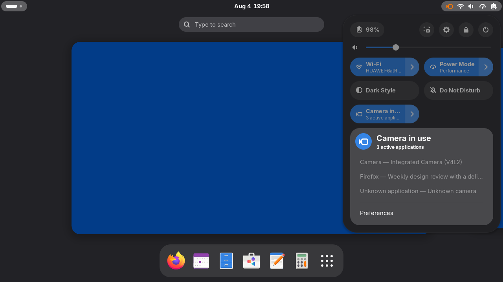
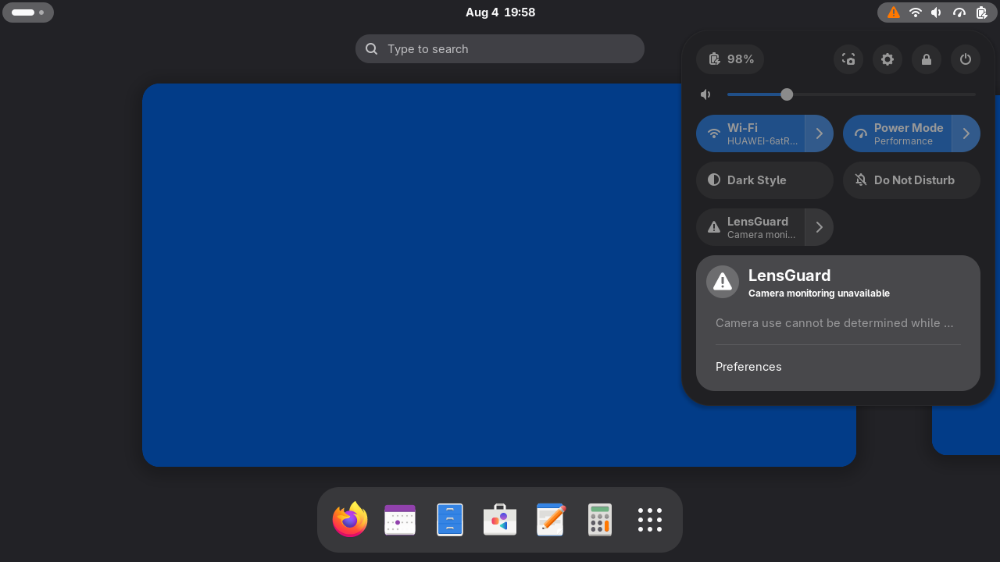

LensGuard is a GNOME Shell camera-privacy indicator backed by an unprivileged Rust user daemon. It
observes active camera capture through PipeWire and exposes session state to a GNOME Shell
extension over the user D-Bus.

## Architecture

The project has completed its first vertical MVP slice. The functional user daemon observes and
classifies the current `PipeWire` graph, resolves application identity away from native callbacks,
maintains camera session state, and publishes it through the stable user-session D-Bus contract.
The GNOME Shell extension asynchronously follows that live service, shows active applications and
cameras in Quick Settings, clears stale state across daemon loss and restart, and provides an
Adwaita preferences window for backend-failure presentation.

The repository follows ports and adapters:

- `camera-core` owns pure domain models, idempotent event reduction, ordered snapshots, and port
  traits without desktop dependencies.
- `camera-pipewire` adapts PipeWire graph events to the domain boundary.
- `camera-app-resolver` resolves process, desktop-entry, and Flatpak application identity.
- `camera-dbus` translates internal snapshots and events into a stable user-session D-Bus API.
- `camera-monitor` is the daemon composition root and owns task lifecycle and recovery.
- `extension/` contains the GNOME Shell client and must communicate with the daemon only over
  the documented D-Bus contract.

Infrastructure-specific types must not leak into `camera-core`, and D-Bus data-transfer objects
must remain separate from domain entities.

## Quick start

```sh
make bootstrap
pnpm install --frozen-lockfile
make check
cargo run -p camera-monitor -- --version
cargo run -p camera-monitor -- --log-level info run
cargo run -p camera-monitor -- inspect-pipewire
cargo run -p camera-monitor -- watch-pipewire
cargo run -p camera-monitor -- serve-dbus
```

See [docs/development.md](docs/development.md) for Fedora setup, recorded local versions, generic
distribution guidance, and live extension test procedures. Implementation sequencing
and scope are defined in [Plan.md](Plan.md). Domain invariants and dependency rules are documented
in [docs/architecture.md](docs/architecture.md).

The inspection command prints a one-time raw graph summary. The watcher prints correlated and
identity-enriched domain start, update, and stop events. See
[tests/manual/camera-session.md](tests/manual/camera-session.md) for live-session checks.
Running with no command, or with `run`, starts the functional daemon. `serve-dbus` remains a
transport-only diagnostic endpoint. The public wire contract and CLI examples are in
[docs/dbus-api.md](docs/dbus-api.md).

## Interface





Open Quick Settings, expand LensGuard, and select **Preferences** to choose whether backend
failures use warning presentation and whether their panel status icon remains visible. Camera-use
indicators remain visible regardless of these failure-only preferences. Notifications are not
implemented.

## License

MIT. See [LICENSE](LICENSE).
