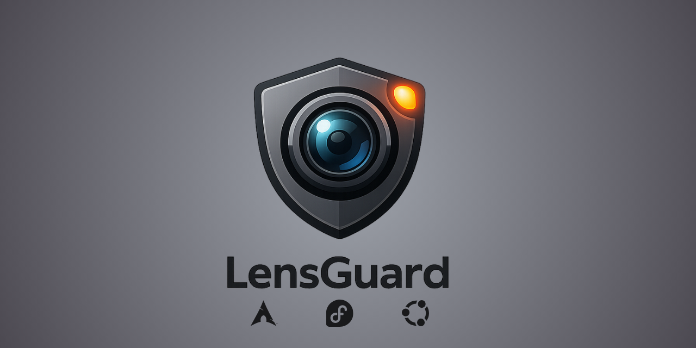
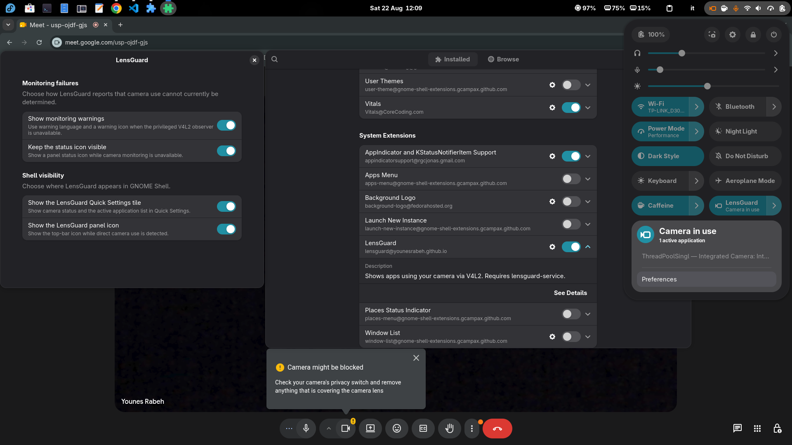
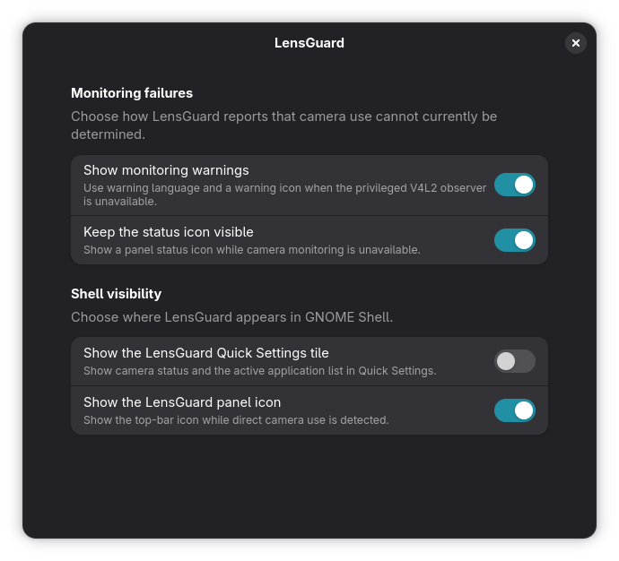
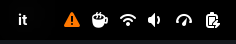

<a href="https://github.com/YounesRabeh/lensguard"></a>

<div align="center">

  <p align="center">
    
    
    
    <a href="https://github.com/YounesRabeh/lensguard/releases/latest"></a>
    <a href="docs/README.md"></a>
  </p>

  <p>A GNOME Shell privacy indicator for applications using cameras directly through V4L2.</p>

  <p align="center">
    <a href="#features">Features</a> •
    <a href="#screenshots">Screenshots</a> •
    <a href="#quick-start">Quick Start</a> •
    <a href="#development">Development</a> •
    <a href="#guides">Guides</a>
  </p>
</div>

---

## Features

- 📷 Detects confirmed direct V4L2 streaming after a successful `VIDIOC_STREAMON`.
- 🛡️ Shows the active application and physical camera in GNOME Quick Settings.
- 🤝 Leaves trusted desktop-broker sessions to GNOME, preventing duplicate indicators.
- ⚠️ Makes monitoring failures and unknown activity visible instead of claiming the camera is idle.
- 🔒 Handles metadata only, never frames, video buffers, command lines, or persistent history.

## Screenshots

| Active direct-camera session | Quick Settings details |
| --- | --- |
|  |  |

| Application identification | Monitoring availability warning |
| --- | --- |
|  |  |

## Quick start

On Fedora, install the complete package from COPR:

```bash
sudo dnf copr enable younesrabeh/lensguard
sudo dnf install lensguard
```

Log out and back in once, then enable the extension:

```bash
gnome-extensions enable lensguard@younesrabeh.github.io
```

LensGuard can also be installed from extensions.gnome.org with the separate `lensguard-service`
package. See the [installation guide](docs/installation.md) for Fedora, Debian/Ubuntu, Arch,
local packages, upgrades, removal, and the difference between the two package routes.

## Development

Requires Rust 1.85+, Clang with the BPF target, GNU Make, GNOME development tools, pnpm,
ripgrep, shellcheck, and unzip. Bootstrap a development environment, then run the full check:

```bash
./scripts/dev/bootstrap-dev.sh
make check
```

| Need | Command |
| --- | --- |
| Format code | `make format` |
| Run tests | `make test` |
| Build the workspace and extension | `make build` |
| Run all checks | `make check` |
| Build release packages | `make package-all` |

See the [development guide](docs/development.md) for the full setup and observer testing workflow.

## Guides

Choose a guide by task, or browse the complete [documentation hub](docs/README.md):

| I want to… | Start here |
| --- | --- |
| Start using LensGuard | [Getting started](docs/getting-started.md) · [Installation](docs/installation.md) |
| Understand its privacy model | [Architecture and privacy boundary](docs/architecture.md) · [D-Bus API](docs/dbus-api.md) |
| Diagnose an issue | [Troubleshooting](docs/troubleshooting.md) |
| Develop, test, or release it | [Development](docs/development.md) · [Release packaging](docs/release.md) · [Release checklist](docs/release-checklist.md) |


## Tech stack

<p align="left">
  <a href="https://www.rust-lang.org/"></a>
  <a href="https://developer.mozilla.org/en-US/docs/Web/JavaScript"></a>
  <a href="https://gjs.guide/"></a>
  <a href="https://www.gnome.org/"></a>
  <a href="https://ebpf.io/"></a>
  <a href="https://www.freedesktop.org/wiki/Software/dbus/"></a>
  <a href="https://systemd.io/"></a>
  <a href="https://www.gnu.org/software/make/"></a>
  <a href="https://pnpm.io/"></a>
</p>

---

## License

Distributed under the [GPL-3.0-or-later](LICENSE) license.
